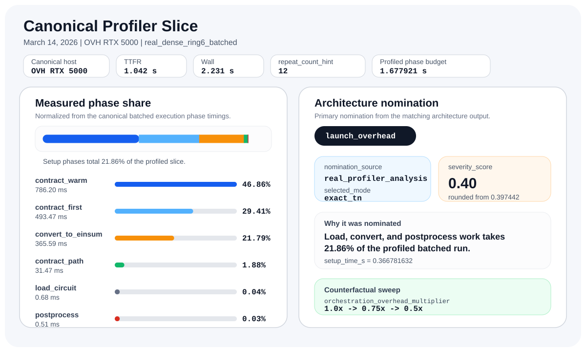
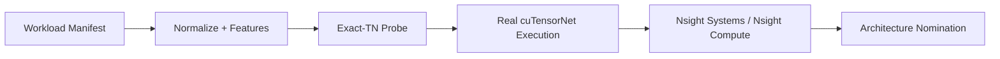

# Quantum Workload Architecture

Quantum Workload Architecture is a Python toolkit for deciding which exact tensor-network plan to run for a quantum workload on a real machine, and for showing what actually bottlenecks that run.

The repo takes workloads from normalized manifests through planning, real `cuTensorNet` execution, profiler reduction, and architecture analysis, with the supporting artifacts either tracked in git or linked from a pinned release.

## What It Shows

- A workload can be normalized, probed, planned, and executed through one reproducible CLI flow.
- The architecture recommendations come from measured Nsight data, not synthetic scoring alone.
- Small summaries stay in git, while large profiler artifacts are published through a pinned release.
- The packaged follow-on reports keep negative and partial remote results intact instead of filtering them out.

## Result Snapshot

| Signal | Value | Evidence |
| --- | --- | --- |
| Canonical host | OVH Ubuntu 25.04, Quadro RTX 5000, driver `580.95.05`, host-installed `nsys` / `QdstrmImporter` / `ncu` | [OVH session summary](docs/runbooks/profiler_ovh_gra9_rtx5000_28_session.md) |
| Evidence source | Real `cuTensorNet` execution with profiler-backed artifact reduction | [Evidence index](docs/reports/first_real_profiler_slice_index.md) |
| First architecture nomination | `nomination_source=real_profiler_analysis` | [Public evidence index](docs/reports/first_real_profiler_slice_index.md) |
| Bottleneck family | `launch_overhead` | [Public evidence index](docs/reports/first_real_profiler_slice_index.md) |
| Setup share | `21.86%` on the canonical batched run | [Public evidence index](docs/reports/first_real_profiler_slice_index.md) |
| Portfolio follow-on package | Measured repeat-ROI, NCU, CUDA Graph, CUDA-Q adapter, and tiny-MNK sidecar reports from the OVH host | [Portfolio index](docs/reports/portfolio_index.md) |
| Reproducibility path | Canonical rerun guide and pinned release assets | [OVH rerun guide](docs/runbooks/ovh_cu13_real_execution.md), [release `v0.5.0-evidence`](https://github.com/CarlosArmeroMoneo/quantum-workload-architecture/releases/tag/v0.5.0-evidence) |



Frozen March 14, 2026 snapshot for the canonical `real_dense_ring6_batched` run. The left panel is normalized from `execution_run.failure_detail_json.phase_times` in the [public evidence index](docs/reports/first_real_profiler_slice_index.md), using the tracked [batched execution payload](evidence/first_real_profiler_slice/real_dense_ring6_batched.ncu.0e70e7aabe3342c1.execution.json); the right panel shows the matching primary nomination from the tracked [batched architecture output](evidence/first_real_profiler_slice/real_dense_ring6_batched.arch.json).

## Capability Matrix

This table is the compact truth pass for public claims. The longer audit lives in [docs/reports/current_state_truth_pass.md](docs/reports/current_state_truth_pass.md).

| Area | Manifest/schema allows | Actually implemented | Real measured evidence exists | Proof file | Claim allowed in README |
| --- | --- | --- | --- | --- | --- |
| Manifest ontology | `qiskit`, `cirq`, `stim`, `cudaq`, `normalized_ir`; broad semantic targets | Broad schema only; executable implementation is narrower | N/A | [Truth pass report](docs/reports/current_state_truth_pass.md) | Describe breadth as schema vocabulary, not working backend support |
| Normalize + features | All workload manifests | `qiskit` OpenQASM2 imports, adapter-backed `cudaq` manifests, and family-backed `normalized_ir` manifests | Yes | [Profiler slice index](docs/reports/first_real_profiler_slice_index.md) | Claim deterministic normalization for implemented source paths only, and call CUDA-Q adapter-backed |
| Structural probe + planner | Any benchmark/workload combination | `qiskit`, adapter-backed `cudaq`, or supported `normalized_ir` families with `state`, `amplitude`, `batched_amplitudes`, `expectation` | Yes | [Profiler slice index](docs/reports/first_real_profiler_slice_index.md) | Claim exact-TN planning for the implemented subset only, and keep CUDA-Q marked adapter-backed |
| Real cuTensorNet execution | Any manifest can declare real intent | Single-GPU `qiskit` workloads for `amplitude` and `batched_amplitudes` only | Yes | [Tracked `nsys` execution payload](evidence/first_real_profiler_slice/real_ghz3_amplitude.nsys.f6bc40e76bb947a6.execution.json) | Claim real measured execution only for the single-GPU Qiskit/OpenQASM2 path |
| Profiler reduction | Profiler metadata can be attached to runs | Nsight Systems reduction is mature; Nsight Compute reduction exists but remains metrics-thin | Yes | [Tracked `ncu` profile summary](evidence/first_real_profiler_slice/real_dense_ring6_batched.ncu.0e70e7aabe3342c1.profile_summary.json) | Claim real profiler-backed summaries and note NCU depth limits explicitly |
| Architecture nominations | Any profiled run can be analyzed | Profiler-backed nominations for launch/setup, memory bandwidth, reuse, planner ROI, capacity, and communication | Yes | [Profiler slice index](docs/reports/first_real_profiler_slice_index.md) | Claim measured nomination reasoning, not exhaustive diagnosis |

## 60-Second CPU Quickstart

The CPU path is meant to prove the end-to-end workflow without requiring Qiskit, CUDA, or Nsight.

```bash
python -m pip install -e .[dev,db]
python scripts/init_db.py --db benchmarks/warehouse/aqs.duckdb --schema benchmarks/warehouse/schema.sql

python -m aqs manifest validate \
  --mode implemented \
  workloads/manifests/generated/dense_universal_smoke.yaml \
  configs/systems/cpu_probe.yml

python -m aqs tnep probe \
  --manifest workloads/manifests/generated/dense_universal_smoke.yaml \
  --probe-strategy structural_real

python -m aqs tnep plan \
  --manifest workloads/manifests/generated/dense_universal_smoke.yaml \
  --system-manifest configs/systems/cpu_probe.yml \
  --probe-strategy structural_real \
  --out artifacts/plans/dense_universal_smoke.plan.json
```

This quickstart is a local smoke path. The headline public result comes from the canonical OVH CUDA 13 host, where real `cuTensorNet` execution and Nsight artifacts are captured and reduced into the evidence linked above. For imported QASM workflows or real GPU execution, install the `quantum` extra and use the runbooks below.

## Evidence Chain



Public repo policy:

- Small curated summaries stay in [`evidence/first_real_profiler_slice`](evidence/first_real_profiler_slice).
- Heavy profiler binaries are published through the GitHub Release `v0.5.0-evidence`.
- Private host credentials are never stored in this repository.

## Technical Appendix

- Capability truth pass: [`docs/reports/current_state_truth_pass.md`](docs/reports/current_state_truth_pass.md)
- Public evidence index: [`docs/reports/first_real_profiler_slice_index.md`](docs/reports/first_real_profiler_slice_index.md)
- Repeat ROI foundation: [`docs/reports/repeat_roi_foundation.md`](docs/reports/repeat_roi_foundation.md)
- Measured repeat ROI results: [`docs/reports/remote_repeat_roi_results_blocked.md`](docs/reports/remote_repeat_roi_results_blocked.md)
- Measured NCU and CUDA Graphs results: [`docs/reports/remote_ncu_and_graphs_results_blocked.md`](docs/reports/remote_ncu_and_graphs_results_blocked.md)
- Measured CUDA-Q adapter and sidecar results: [`docs/reports/remote_cudaq_and_sidecar_results_blocked.md`](docs/reports/remote_cudaq_and_sidecar_results_blocked.md)
- OVH measured-validation follow-on: [`docs/reports/ovh_measured_validation_follow_on.md`](docs/reports/ovh_measured_validation_follow_on.md)
- OVH baseline freeze: [`docs/reports/ovh_v1_baseline.md`](docs/reports/ovh_v1_baseline.md)
- OVH top-3 reconcile note: [`docs/reports/ovh_top3_reconcile_note.md`](docs/reports/ovh_top3_reconcile_note.md)
- OVH merge-gate policy: [`docs/reports/ovh_merge_gate_policy.md`](docs/reports/ovh_merge_gate_policy.md)
- OVH calibration readout: [`docs/reports/ovh_calibration_readout.md`](docs/reports/ovh_calibration_readout.md)
- OVH confidence-validation readout: [`docs/reports/ovh_confidence_validation_readout.md`](docs/reports/ovh_confidence_validation_readout.md)
- OVH confidence defaulting readout: [`docs/reports/ovh_confidence_defaulting_readout.md`](docs/reports/ovh_confidence_defaulting_readout.md)
- TTFR variance methodology v2: [`docs/reports/ttfr_variance_methodology_v2.md`](docs/reports/ttfr_variance_methodology_v2.md)
- OVH plan reuse prototype readout: [`docs/reports/ovh_plan_reuse_prototype_readout.md`](docs/reports/ovh_plan_reuse_prototype_readout.md)
- OVH Gate P policy: [`docs/reports/ovh_gate_p_policy.md`](docs/reports/ovh_gate_p_policy.md)
- OVH persistent executor prototype plan: [`docs/reports/ovh_persistent_executor_prototype_plan.md`](docs/reports/ovh_persistent_executor_prototype_plan.md)
- OVH persistent executor prototype readout: [`docs/reports/ovh_persistent_executor_prototype_v1.md`](docs/reports/ovh_persistent_executor_prototype_v1.md)
- OVH Gate S policy: [`docs/reports/ovh_gate_s_policy.md`](docs/reports/ovh_gate_s_policy.md)
- OVH session runner prototype plan: [`docs/reports/ovh_session_runner_prototype_plan.md`](docs/reports/ovh_session_runner_prototype_plan.md)
- OVH session runner prototype readout: [`docs/reports/ovh_session_runner_prototype_v1.md`](docs/reports/ovh_session_runner_prototype_v1.md)
- OVH embedded session client readout: [`docs/reports/ovh_embedded_session_client_v1.md`](docs/reports/ovh_embedded_session_client_v1.md)
- Portfolio index: [`docs/reports/portfolio_index.md`](docs/reports/portfolio_index.md)
- Tiny-MNK sidecar lab: [`sidecars/tiny_mnk_lab/README.md`](sidecars/tiny_mnk_lab/README.md)
- Canonical OVH rerun guide: [`docs/runbooks/ovh_cu13_real_execution.md`](docs/runbooks/ovh_cu13_real_execution.md)
- OVH persistent executor runbook: [`docs/runbooks/ovh_persistent_executor.md`](docs/runbooks/ovh_persistent_executor.md)
- OVH session runner runbook: [`docs/runbooks/ovh_session_runner.md`](docs/runbooks/ovh_session_runner.md)
- OVH embedded session client runbook: [`docs/runbooks/ovh_embedded_session_client.md`](docs/runbooks/ovh_embedded_session_client.md)
- Portfolio demo runbook: [`docs/runbooks/portfolio_demo.md`](docs/runbooks/portfolio_demo.md)
- Canonical OVH session summary: [`docs/runbooks/profiler_ovh_gra9_rtx5000_28_session.md`](docs/runbooks/profiler_ovh_gra9_rtx5000_28_session.md)
- Generic profiler-host runbook: [`docs/runbooks/profiler_linux_host.md`](docs/runbooks/profiler_linux_host.md)
- Known local-host blockers: [`docs/known_limitations/profiler_host_blockers.md`](docs/known_limitations/profiler_host_blockers.md)

## Repository Notes

- The public project name is **Quantum Workload Architecture**; the stable Python package and CLI remain `aqs` for compatibility.
- Nsight Compute profiling now supports `python -m aqs profile ncu --profile-mode basic|diagnostic|deep`, backed by `configs/profiling/ncu_metric_sets.yaml`.
- The measured repeat-ROI pass on the OVH host kept autotune conservative; the dry-run suggestion to lower thresholds to `{2, 2}` was not promoted.
- CUDA Graphs were measured on the OVH host, but capture failed on the default (legacy) stream, so the repo does not claim graph speedups.
- `source_format: cudaq` is now implemented through an adapter-backed path: `source.loader: cudaq_python_file` must export `aqs_cudaq_program()`, and today that path normalizes and plans structurally but does not claim real measured CUDA-Q execution.
- The tiny-MNK sidecar now has measured benchmark and Nsight Compute outputs, but it is a shape-isolation lab and not a parity proxy for cuTensorNet's internal kernel family.
- Confidence-aware validation is now the default reporting surface for planner validation summaries, but the current OVH evidence still does not justify a planner retune.
- Explicit reusable plan bundles are now available as an opt-in performance path for `aqs tnep execute`, but the current OVH evidence shows only modest low-repeat amplitude CLI wins and does not change any ranking or calibration claim.
- Persistent execution is now a separate local experimental performance path behind `persistent-executor` and Gate P; on the canonical OVH trio it cut warm bundle-hit CLI wall by about `1.48 s` per request while keeping selected-plan identity, correctness, and compatibility strict.
- The new session runner is another local experimental performance path behind Gate S; on the same OVH trio it cut the remaining warm persistent CLI wall from about `653-672 ms` down to about `51-56 ms` per request with no plan-id drift, no fallback, and no ranking implication.
- The embedded session client now packages that same OVH fast path as a reusable local Python API; on the canonical trio it stayed in the same regime at about `51-57 ms` per request for existing-worker sessions and about `47-52 ms` with autospawn, again with no plan-id drift, no fallback, and no ranking implication.
- Most of `artifacts/` and all of `release-assets/` are intentionally ignored so local reruns do not pollute the public tree. Small tracked truth-pass fixtures under `artifacts/truth_pass/` are the current exception.
- `ovh.conf.example` documents the expected OVH client shape. Real credentials must live outside git.
