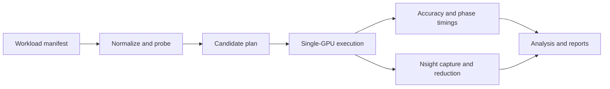

# Quantum Workload Atlas

[](https://github.com/CarlosArmeroMoneo/quantum-workload-architecture/actions/workflows/cpu-smoke.yml)

**Measure where quantum tensor-network simulations spend time, then test which execution changes help.**

Quantum Workload Atlas connects workload manifests, tensor-network planning, real GPU execution, accuracy checks, and Nsight profiling. Its reports distinguish measurements from model predictions and unsupported or future execution paths.

The project name is **Quantum Workload Atlas (QWA)**. This repository keeps the URL `quantum-workload-architecture`; the Python package and CLI remain `aqs` for compatibility.

## Start here

Read the [project overview](PROJECT_OVERVIEW.md) for the engineering scope, the [measured results](docs/reports/measured_results.md) for the numbers and their limits, or the [review guide](docs/reports/how_to_review_this_project.md) to inspect the evidence yourself. The [documentation index](docs/README.md) contains the detailed reports and runbooks.

## Two measured results

Both results below come from the single-GPU OVH Quadro RTX 5000 environment. They answer different questions and must not be combined into a single speedup claim.

| Result | Observation | What it establishes |
| --- | --- | --- |
| Profiler-backed case study | Load, conversion, and postprocessing account for **21.86% of recorded phase time** in `real_dense_ring6_batched`. | A measured reason to investigate orchestration overhead; not a demonstrated 21.86% speedup. |
| Warm session execution | Across three workloads, median warm request wall time changes from **653–672 ms** through the persistent CLI to **51–56 ms** through an existing-worker session. | Lower request/invocation overhead under the recorded benchmark conditions; not faster contraction kernels or a cross-hardware benchmark. |

The [result details](docs/reports/measured_results.md) link directly to the execution, profile, architecture, and session-summary JSON. The session summary records no correctness drift, selected-plan drift, or fallback. Cold startup is excluded from those warm per-request medians and remains a separate cost.


This figure is a frozen March 14, 2026 measurement. Its phase shares use the sum of the recorded phases, not the whole process wall time. The `launch_overhead` label is a candidate explanation produced by the analysis rules, not proof that GPU kernel launch latency is the only bottleneck. The canonical Nsight Compute summary does not contain occupancy, SM-utilization, or DRAM-utilization measurements.

## What the repository implements



| Layer | Implemented scope |
| --- | --- |
| Inputs and planning | Qiskit/OpenQASM2, supported family-backed normalized workloads, and a CUDA-Q adapter for normalization and structural planning. |
| Real GPU execution | Single-GPU Qiskit/OpenQASM2 `amplitude` and `batched_amplitudes` through cuTensorNet. |
| Profiling and analysis | Nsight Systems and Nsight Compute summaries, instrumented execution timings, calibration reports, and bottleneck candidates with supporting evidence. Metric coverage varies by capture. |
| Execution experiments | Reusable plan bundles, a persistent worker, a session runner, and an embedded session client. These are bounded local performance paths, not additional simulator backends. |
| CPU workflow | Manifest validation, structural probing, planning, and tests without CUDA or Nsight. This does not reproduce GPU timings. |

The schema describes more than the executor supports. Cirq and Stim entries are vocabulary, not working execution integrations. CUDA-Q is adapter-backed structural planning only; native CUDA-Q execution, distributed GPU results, and QPU execution are not established by this public package. The tiny-MNK sidecar is a separate shape-isolation experiment, not a replacement for cuTensorNet internals.

## Release and evidence status

| Item | Status |
| --- | --- |
| Latest project release | [v0.2-crossover-calibration](https://github.com/CarlosArmeroMoneo/quantum-workload-architecture/releases/tag/v0.2-crossover-calibration), published June 8, 2026: calibration and preflight tooling, not a new GPU campaign. |
| Python package version | `aqs` reports `0.5.0`. The named project releases describe evidence/methodology milestones and are not synchronized with the package version. |
| Canonical measured slice | OVH RTX 5000; packaged in [v0.1-first-real-profiler-slice](https://github.com/CarlosArmeroMoneo/quantum-workload-architecture/releases/tag/v0.1-first-real-profiler-slice). |
| Raw profiler archive | [v0.5.0-evidence](https://github.com/CarlosArmeroMoneo/quantum-workload-architecture/releases/tag/v0.5.0-evidence) is a historical evidence-archive tag, not the current project release. |
| Other accelerators | GCP A100 remains pending acceptance; local NVIDIA 6GB results are preflight/dev only. H100, Hyperstack, TPU/JAX, and QPU templates or plans are not accepted measured results in this package. |
| Validation | The CI badge links to workflow results. CPU tests do not certify GPU performance or reproduce the historical captures. |

No validated general-purpose fastest-backend advisor or quantum advantage is claimed. The canonical profiled case also exposes substantial planner prediction errors; these are reported rather than treated as calibrated performance estimates.

## CPU quickstart

Use a repository checkout and Python 3.10–3.12, the versions in the CPU test matrix. The commands below use Bash, for example on Linux or WSL2. No GPU, cloud credentials, Qiskit, or Nsight is needed for this path.

This generated workload uses `surrogate_only` to build a family-derived tensor-network shape for planning. The `structural_real` strategy instead requires an imported circuit source and must not be used with this generated `normalized_ir` example.

```bash
git clone https://github.com/CarlosArmeroMoneo/quantum-workload-architecture.git
cd quantum-workload-architecture
python -m venv .venv
source .venv/bin/activate
python -m pip install -e '.[dev,db]'

python scripts/init_db.py --db benchmarks/warehouse/aqs.duckdb --schema benchmarks/warehouse/schema.sql

python -m aqs manifest validate \
  --mode implemented \
  workloads/manifests/generated/dense_universal_smoke.yaml \
  configs/systems/cpu_probe.yml

python -m aqs tnep probe \
  --manifest workloads/manifests/generated/dense_universal_smoke.yaml \
  --probe-strategy surrogate_only

python -m aqs tnep plan \
  --manifest workloads/manifests/generated/dense_universal_smoke.yaml \
  --system-manifest configs/systems/cpu_probe.yml \
  --probe-strategy surrogate_only \
  --out artifacts/plans/dense_universal_smoke.plan.json
```

Successful commands validate the inputs, return a successful structural surrogate probe, and write a plan JSON. These are planning outputs, not circuit amplitude calculations or measured GPU results. For a real GPU rerun, follow the [OVH execution runbook](docs/runbooks/ovh_cu13_real_execution.md). The `quantum` extra installs Qiskit; it does not install the full CUDA/cuQuantum/Nsight environment.

To run the non-GPU validation suite:

```bash
python -m ruff check src tests scripts
python -m mypy src/aqs
python -m pytest -m "not gpu and not profiler" -q
bash scripts/public_check.sh
```

## Evidence and further reading

Small curated summaries and selected experiment artifacts are tracked in Git. Heavy profiler binaries belong to the linked releases or configured external storage. Historical package checksums apply to their original release contents, not to changing documentation on `main`. See the [storage management runbook](docs/runbooks/storage_management.md) for artifact handling; keep credentials and private host configuration outside Git.

<details>
<summary>Methodology and evidence references</summary>

- [Public release audit](docs/reports/public_release_audit.md) and [canonical evidence index](docs/reports/first_real_profiler_slice_index.md).
- [Evidence contract](docs/architecture/evidence_contract.md), [profiler signal taxonomy](docs/architecture/profiler_signal_taxonomy.md), and [kernel taxonomy report](docs/reports/profiler_kernel_taxonomy_current_evidence.md).
- [Model calibration table](docs/reports/model_calibration_table.md) and [historical capability audit](docs/reports/current_state_truth_pass.md).
- [Experiment card template](docs/experiments/experiment_card_template.md) and [launch-overhead counterfactual](docs/experiments/launch_overhead_counterfactual.md).
- [GCP A100 acceptance gate](docs/runbooks/gcp_a100_acceptance_gate.md) and [future TPU sister-workload design](docs/architecture/tpu_sister_workload_lane.md).
- [v0.1 release notes](docs/reports/v0_1_first_real_profiler_slice_release_notes.md), [v0.2 release notes](docs/reports/v0_2_crossover_release_notes.md), and [staged roadmap](docs/reports/next_pr_roadmap.md).

</details>

[License](LICENSE)
