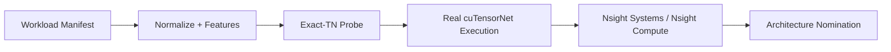

# Quantum Workload Architecture

Quantum Workload Architecture is a Python toolkit and evidence trail for normalizing quantum workloads, planning exact tensor-network execution, and grounding architecture recommendations in measured profiler data.

## What This Repo Does

- Normalizes generated and imported quantum workloads into a consistent manifest format.
- Extracts structural and exact-TN probe signals before committing to expensive runs.
- Executes real `cuTensorNet` slices when the host stack is available.
- Carries profiler evidence into architecture-facing summaries instead of relying on synthetic heuristics alone.

## 60-Second CPU Quickstart

The CPU path is meant to prove the end-to-end workflow without requiring Qiskit, CUDA, or Nsight.

```bash
python -m pip install -e .[dev,db]
python scripts/init_db.py --db benchmarks/warehouse/aqs.duckdb --schema benchmarks/warehouse/schema.sql

python -m aqs manifest validate \
  workloads/manifests/generated/dense_universal_smoke.yaml \
  configs/systems/cpu_probe.yml

python -m aqs tnep probe \
  --manifest workloads/manifests/generated/dense_universal_smoke.yaml \
  --probe-strategy structural_real

python -m aqs tnep plan \
  --manifest workloads/manifests/generated/dense_universal_smoke.yaml \
  --system-manifest configs/systems/cpu_probe.yml \
  --probe-strategy structural_real \
  --out artifacts/plans/dense_universal_smoke.plan.json
```

For imported QASM workflows or real GPU execution, install the `quantum` extra and use the runbooks linked below.

## Result Snapshot

- Canonical host: OVH Ubuntu 24.04 with a Quadro RTX 5000 and host-installed `nsys` / `QdstrmImporter` / `ncu`.
- First real architecture nomination: `nomination_source=real_profiler_analysis`.
- First real bottleneck family: `launch_overhead`.
- Observed setup share on the canonical batched run: `21.86%`.

## Evidence Chain



Public repo policy:

- Small curated summaries stay in [`evidence/first_real_profiler_slice`](evidence/first_real_profiler_slice).
- Heavy profiler binaries are published through the GitHub Release `v0.5.0-evidence`.
- Private host credentials are never stored in this repository.

## Technical Appendix

- Public evidence index: [`docs/reports/first_real_profiler_slice_index.md`](docs/reports/first_real_profiler_slice_index.md)
- Canonical OVH rerun guide: [`docs/runbooks/ovh_cu13_real_execution.md`](docs/runbooks/ovh_cu13_real_execution.md)
- Canonical OVH session summary: [`docs/runbooks/profiler_ovh_gra9_rtx5000_28_session.md`](docs/runbooks/profiler_ovh_gra9_rtx5000_28_session.md)
- Generic profiler-host runbook: [`docs/runbooks/profiler_linux_host.md`](docs/runbooks/profiler_linux_host.md)
- Known local-host blockers: [`docs/known_limitations/profiler_host_blockers.md`](docs/known_limitations/profiler_host_blockers.md)

## Repository Notes

- The installable package is still named `aqs`; the repo rename is presentation-only.
- `artifacts/` and `release-assets/` are intentionally ignored so local reruns do not pollute the public tree.
- `ovh.conf.example` documents the expected OVH client shape. Real credentials must live outside git.
