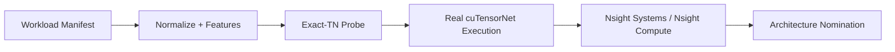

# Quantum Workload Architecture

Quantum Workload Architecture is a Python toolkit for answering a practical systems question: when a quantum workload lands on a real host, which execution plan is worth running and what bottleneck is actually limiting it?

It is built as an engineering evidence trail, not just a simulator wrapper. The repository carries workloads from normalized manifests through exact tensor-network planning, real `cuTensorNet` execution, profiler reduction, and architecture-facing conclusions backed by tracked artifacts.

## What This Repo Proves

- A quantum workload can be normalized, probed, planned, and executed through one reproducible CLI flow.
- Architecture recommendations can be grounded in measured Nsight evidence instead of synthetic heuristics alone.
- The public repository can stay lightweight while still linking to pinned profiler artifacts and rerun instructions.

## Result Snapshot

| Signal | Value | Evidence |
| --- | --- | --- |
| Canonical host | OVH Ubuntu 24.04, Quadro RTX 5000, host-installed `nsys` / `QdstrmImporter` / `ncu` | [OVH session summary](docs/runbooks/profiler_ovh_gra9_rtx5000_28_session.md) |
| Evidence source | Real `cuTensorNet` execution with profiler-backed artifact reduction | [Evidence index](docs/reports/first_real_profiler_slice_index.md) |
| First architecture nomination | `nomination_source=real_profiler_analysis` | [Public evidence index](docs/reports/first_real_profiler_slice_index.md) |
| Bottleneck family | `launch_overhead` | [Public evidence index](docs/reports/first_real_profiler_slice_index.md) |
| Setup share | `21.86%` on the canonical batched run | [Public evidence index](docs/reports/first_real_profiler_slice_index.md) |
| Reproducibility path | Canonical rerun guide and pinned release assets | [OVH rerun guide](docs/runbooks/ovh_cu13_real_execution.md), [release `v0.5.0-evidence`](https://github.com/CarlosArmeroMoneo/quantum-workload-architecture/releases/tag/v0.5.0-evidence) |

## 60-Second CPU Quickstart

The CPU path is meant to prove the end-to-end workflow without requiring Qiskit, CUDA, or Nsight.

```bash
python -m pip install -e .[dev,db]
python scripts/init_db.py --db benchmarks/warehouse/aqs.duckdb --schema benchmarks/warehouse/schema.sql

python -m aqs manifest validate \
  workloads/manifests/generated/dense_universal_smoke.yaml \
  configs/systems/cpu_probe.yml

python -m aqs tnep probe \
  --manifest workloads/manifests/generated/dense_universal_smoke.yaml \
  --probe-strategy structural_real

python -m aqs tnep plan \
  --manifest workloads/manifests/generated/dense_universal_smoke.yaml \
  --system-manifest configs/systems/cpu_probe.yml \
  --probe-strategy structural_real \
  --out artifacts/plans/dense_universal_smoke.plan.json
```

This quickstart is a local smoke path. The headline public result comes from the canonical OVH CUDA 13 host, where real `cuTensorNet` execution and Nsight artifacts are captured and reduced into the evidence linked above. For imported QASM workflows or real GPU execution, install the `quantum` extra and use the runbooks below.

## Evidence Chain



Public repo policy:

- Small curated summaries stay in [`evidence/first_real_profiler_slice`](evidence/first_real_profiler_slice).
- Heavy profiler binaries are published through the GitHub Release `v0.5.0-evidence`.
- Private host credentials are never stored in this repository.

## Technical Appendix

- Public evidence index: [`docs/reports/first_real_profiler_slice_index.md`](docs/reports/first_real_profiler_slice_index.md)
- Canonical OVH rerun guide: [`docs/runbooks/ovh_cu13_real_execution.md`](docs/runbooks/ovh_cu13_real_execution.md)
- Canonical OVH session summary: [`docs/runbooks/profiler_ovh_gra9_rtx5000_28_session.md`](docs/runbooks/profiler_ovh_gra9_rtx5000_28_session.md)
- Generic profiler-host runbook: [`docs/runbooks/profiler_linux_host.md`](docs/runbooks/profiler_linux_host.md)
- Known local-host blockers: [`docs/known_limitations/profiler_host_blockers.md`](docs/known_limitations/profiler_host_blockers.md)

## Repository Notes

- The public project name is **Quantum Workload Architecture**; the stable Python package and CLI remain `aqs` for compatibility.
- `artifacts/` and `release-assets/` are intentionally ignored so local reruns do not pollute the public tree.
- `ovh.conf.example` documents the expected OVH client shape. Real credentials must live outside git.
