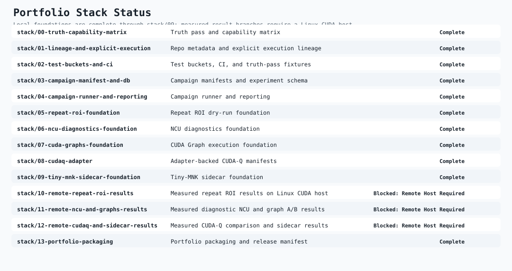

# Portfolio Index

This index packages the stacked-branch rollout as it exists in this workspace on April 4, 2026, after the measured OVH pass refreshed `stack/10` through `stack/12`.

## Completed Foundations

- `stack/00-truth-capability-matrix`: [`docs/reports/current_state_truth_pass.md`](current_state_truth_pass.md)
- `stack/04-campaign-runner-and-reporting`: CPU-safe campaign runner via [`configs/campaigns/cpu_dry_run_v1.yaml`](../../configs/campaigns/cpu_dry_run_v1.yaml)
- `stack/05-repeat-roi-foundation`: [`docs/reports/repeat_roi_foundation.md`](repeat_roi_foundation.md)
- `stack/07-cuda-graphs-foundation`: graph-mode plumbing and [`configs/campaigns/cuda_graphs_ablation_v1.yaml`](../../configs/campaigns/cuda_graphs_ablation_v1.yaml)
- `stack/08-cudaq-adapter`: adapter-backed CUDA-Q manifests under [`workloads/manifests/imported`](../../workloads/manifests/imported)
- `stack/09-tiny-mnk-sidecar-foundation`: [`sidecars/tiny_mnk_lab/README.md`](../../sidecars/tiny_mnk_lab/README.md)

## Measured Remote Result Branches

- `stack/10-remote-repeat-roi-results`: [`docs/reports/remote_repeat_roi_results_blocked.md`](remote_repeat_roi_results_blocked.md), with curated outputs in [`artifacts/campaigns/repeat_roi_v1`](../../artifacts/campaigns/repeat_roi_v1)
- `stack/11-remote-ncu-and-graphs-results`: [`docs/reports/remote_ncu_and_graphs_results_blocked.md`](remote_ncu_and_graphs_results_blocked.md), with curated outputs in [`artifacts/profiles/ncu`](../../artifacts/profiles/ncu) and [`artifacts/campaigns/cuda_graphs_ablation_v1`](../../artifacts/campaigns/cuda_graphs_ablation_v1)
- `stack/12-remote-cudaq-and-sidecar-results`: [`docs/reports/remote_cudaq_and_sidecar_results_blocked.md`](remote_cudaq_and_sidecar_results_blocked.md), with curated outputs in [`artifacts/cudaq_adapter_compare`](../../artifacts/cudaq_adapter_compare) and [`sidecars/tiny_mnk_lab/results/ncu`](../../sidecars/tiny_mnk_lab/results/ncu)

## Release Package

- Curated manifest: [`docs/reports/portfolio_release_manifest.json`](portfolio_release_manifest.json)
- Checksums: [`SHA256SUMS.txt`](../../SHA256SUMS.txt)
- Demo runbook: [`docs/runbooks/portfolio_demo.md`](../runbooks/portfolio_demo.md)

## Notes

- The measured host for the packaged remote results is OVH `ovh_gra9_rtx5000_28`: Quadro RTX 5000, Ubuntu `25.04`, driver `580.95.05`, and green profiling readiness in `configs/systems/ovh_gra9_rtx5000_28.profiling_ready.json`.
- A measured-validation follow-on assessment now exists in [`docs/reports/ovh_measured_validation_follow_on.md`](ovh_measured_validation_follow_on.md); it confirms a real OVH `require_real` slice and recurring `planner_roi`, but it does not yet claim a clean planner-calibration success.
- The frozen measured-validation baseline now lives in [`docs/reports/ovh_v1_baseline.md`](ovh_v1_baseline.md), with the top-3 wording audit captured in [`docs/reports/ovh_top3_reconcile_note.md`](ovh_top3_reconcile_note.md).
- Confidence-aware follow-on reporting now lives in [`docs/reports/ovh_confidence_validation_readout.md`](ovh_confidence_validation_readout.md), with tracked artifacts in `artifacts/measured_validation_runs/ovh_v1_confidence/`.
- The repeat-ROI pass recorded mostly negative optimizer deltas, so the measured package keeps the existing planner defaults rather than promoting the earlier dry-run threshold suggestion.
- CUDA Graph capture failed on the default (legacy) stream in every measured attempt, so the package keeps `graph_mode=off` as the recommendation.
- CUDA-Q remains adapter-backed for structural comparison only; the repo still does not claim native CUDA-Q runtime execution evidence.
- The tiny-MNK sidecar is now measured and curated, but it remains a shape-isolation lab rather than a parity proxy for the internal cuTensorNet kernel family.
